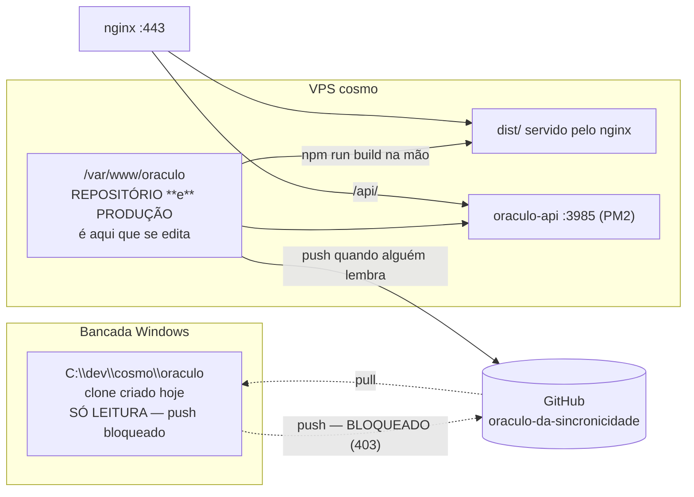

# Plano de arquitetura do Oráculo da Sincronicidade

**Data:** 27/08/2026 · **Método:** Arquitetura Imperatriz (modo auditoria + refatoração
cirúrgica) · **Escopo:** eliminar a divergência entre produção e git.

Tudo aqui foi **medido hoje na VPS**, não lembrado. Onde não deu para medir, está
escrito **NÃO VERIFICADO**.

---

## 1. O caso concreto que originou este plano

Em 17/08 foram escritas 70 linhas no `server/server.js` (encerramento com graça:
SIGTERM/SIGINT gravam o ledger de créditos na hora e drenam a requisição em voo).
O código foi salvo **direto na VPS**, entrou em produção, funcionou — e **ficou 10
dias fora do git**.

O que isso custou em risco, enquanto durou:

| Risco | Por quê |
|---|---|
| Perda total da mudança | Um `git checkout` ou um redeploy sobrescreveria as 70 linhas sem aviso |
| Fora do backup | O backup da bancada copia `C:\dev\cosmo`; o que só existe na VPS depende do backup da VPS — **cobertura do `/var/www/oraculo` NÃO VERIFICADA nesta sessão** |
| Impossível reverter | Sem commit, não há "voltar para antes" |
| GitHub mentindo | Quem lesse o repositório veria um app que não é o que está no ar |

Fechado hoje: commit `dcab0d8`, push confirmado por `git ls-remote` (remoto =
`dcab0d8`), árvore limpa, health 200.

**A causa não foi descuido.** A causa é arquitetural: *editar na VPS é o caminho
mais curto que existe hoje*, porque o repositório de trabalho **é** a pasta de
produção. Enquanto for assim, a divergência volta — plano nenhum segura.

---

## 2. Porte deste app

O pedido dizia "porte solo". A evidência diz outra coisa:

- Domínio público (`oraculo.portalthecosmo.com`), usuárias reais e desconhecidas
- Contagem de créditos por IP → existe expectativa de **cobrança futura**
- Sem SLA, uma VPS só, volume baixo

**Classificação: Porte 2 com borda pública.** Não é ferramenta de bastidor (porte 1),
não é SaaS com escala (porte 4). Isso muda as recomendações: Docker e planta de infra
passam a valer a pena; control plane e multi-região continuam sendo over-engineering.

---

## 3. Diagnóstico dos 6 padrões

| # | Padrão | Nota | O que a evidência mostra | Ação para subir |
|---|---|---|---|---|
| 1 | Fila + Aviso | **1/10** | Narração leva ~150s **dentro do request** (medido 17/08: 2m30s, 22 MB de base64). `proxy_read_timeout` de 300s existe só para segurar isso. Nada em fila; se o processo reinicia no meio, a usuária perde a narração e o crédito já foi gasto | Narração assíncrona: responde `202` + id, gera em background, front busca o resultado |
| 2 | Controle vs Execução | **5/10** | Modelo e chave saem do `.env` sem rebuild — configuração externa existe. Painel central não existe, e **não deve existir**: 1 app só | Nenhuma. Over-engineering neste porte |
| 3 | Molde + Dados | **7/10** | Prompt da Sacerdotisa isolado em `server/prompt.js`, versionado, separado do transporte. Entrada simples da usuária gera saída complexa | Nenhuma urgente |
| 4 | Receita Congelada | **1/10** | Sem `Dockerfile`. Deploy é `npm run build` na mão dentro da pasta de produção. **Edição direta em produção aconteceu** — é o caso do item 1 | Guarda de deploy agora; Docker no 90 |
| 5 | Planta da Infra | **5/10** | `infra/nginx-oraculo.conf` versionado hoje (idêntico ao `/etc`, só ganhou cabeçalho); `server/ecosystem.config.js` versionado; `.env.example` presente; `.gitignore` correto (`.env*`, `server/data/`). Sem `docker-compose`, sem script de recriação da VPS | `deploy.sh` versionado; depois `Dockerfile` |
| 6 | Concentre na Borda | **7/10** | Nginx faz SSL (Certbot), rate-limit (3 diretivas ativas) e proxy. `/health` existe e responde. Logs estruturados no código (`log()` com nível e evento) | Agregação de log — baixa prioridade |

### Nota final ponderada (Porte 2: padrões 4, 5 e 6 pesam 25%; os outros 8%)

**3,7 / 10 → 🟠 Frágil.**

Leia direito: **o app funciona e está bem escrito.** A nota baixa não é do código —
é do **processo que leva o código até o ar**. O Oráculo é um app saudável rodando
numa esteira de deploy que não tem freio.

---

## 4. Anti-patterns detectados

| # | Anti-pattern | Risco | Onde | Correção |
|---|---|---|---|---|
| 10 | **Modificação manual em produção** | 🔴 Crítico | `/var/www/oraculo` é ao mesmo tempo repositório de trabalho e raiz servida pelo nginx | Bancada vira a fonte do código; VPS só recebe (`git pull` + build) |
| 3 | **Deploy manual sem rollback** | 🔴 Crítico | `npm run build` digitado à mão, sem verificação e sem volta | `infra/deploy.sh` com guarda, verificação e rollback automático |
| 4 | **Worker no processo web** | 🟠 Alto | Narração de 150s dentro do request HTTP | Narração assíncrona (roadmap 60 dias) |
| 7 | **Backup sem prova** | 🟠 A confirmar | `.env` e `server/data/creditos.json` **não estão no git de propósito** — logo, só existem na VPS. Se o backup da VPS não os cobre, não existem em lugar nenhum | Verificar cobertura e provar com uma restauração |

Não são anti-patterns aqui (verificado): rate-limit existe, healthcheck existe,
`.env` nunca foi versionado, sem SQL injection (não há banco SQL), CORS não aberto.

---

## 5. Arquitetura de hoje



**O defeito está desenhado aí:** a única seta que produz código sai de dentro da
produção. O git é consequência do deploy, não condição dele.

## 6. Arquitetura proposta

```mermaid
flowchart LR
    subgraph BANCADA["Bancada Windows — onde se constrói"]
        B["C:\\dev\\cosmo\\oraculo<br/>fonte da verdade do CÓDIGO"]
    end
    GH[("GitHub — a ponte"))]
    subgraph VPS["VPS cosmo — onde roda"]
        G["/var/www/oraculo<br/>só recebe: pull + build"]
        D["dist/"]
        API["oraculo-api :3985"]
    end
    B -->|"commit + push"| GH
    GH -->|"infra/deploy.sh: pull --ff-only"| G
    G --> D
    G --> API
    S["infra/sentinela-git.sh<br/>cron diário"] -.->|"grita se produção divergir"| G
```

**A regra de ouro, em uma frase:** *o servidor nunca é origem de código — só destino.*

Fluxo novo, em três comandos:

1. Na bancada: edita, `git commit`, `git push`
2. Na VPS: `bash infra/deploy.sh`
3. O `deploy.sh` recusa qualquer deploy se houver mudança não commitada na VPS

---

## 7. Roadmap 30 / 60 / 90 (priorizado por ICE)

ICE = Impacto × Confiança ÷ Esforço, cada um de 1 a 10.

### Agora — 30 dias

| # | Ação | I | C | E | ICE | Estado |
|---|---|---|---|---|---|---|
| 0 | **Destravar o push da bancada** (hoje dá 403: token do `gh` inválido e a chave SSH não abre este repositório). Sem isso, o modelo inteiro não sai do papel | 10 | 10 | 1 | **100** | 🔴 **bloqueador — depende da Ana** |
| 1 | Instalar `infra/deploy.sh` na VPS e passar a usar só ele | 9 | 9 | 2 | **40** | 🟡 escrito, não instalado |
| 2 | Instalar `infra/sentinela-git.sh` no cron diário | 8 | 9 | 2 | **36** | 🟡 escrito, não instalado |
| 3 | Verificar se o backup da VPS cobre `.env` e `server/data/creditos.json`, e **provar com uma restauração** | 9 | 8 | 3 | **24** | 🔴 não verificado |
| 4 | Registrar o Oráculo no `INVENTARIO.md` com a fonte da verdade nova | 6 | 10 | 1 | **60** | ✅ feito nesta sessão |

### Depois — 60 dias

| # | Ação | I | C | E | ICE |
|---|---|---|---|---|---|
| 5 | **Narração assíncrona**: `202` + id + polling. Mata o request de 150s, permite baixar o `proxy_read_timeout` de 300s para 60s e faz o `deploy.sh` poder reiniciar sem medo | 9 | 7 | 6 | **10,5** |
| 6 | Billing do Google Cloud com alerta de R$ 50/mês → destrava a imagem simbólica (hoje 429 `limit: 0`) | 7 | 9 | 2 | **31** |
| 7 | `.env.example` conferido contra o `.env` real, campo a campo | 5 | 9 | 1 | **45** |

### Horizonte — 90 dias

| # | Ação | I | C | E | ICE |
|---|---|---|---|---|---|
| 8 | `Dockerfile` + `docker-compose.yml` versionados: produção deixa de ser pasta editável e passa a ser imagem | 8 | 7 | 7 | **8** |
| 9 | Cobrança de verdade (login por e-mail, contagem por pessoa em vez de por IP) — é projeto próprio, não item de infra | 8 | 6 | 9 | **5,3** |

---

## 8. As 12 perguntas-chave

1. **Preciso de fila?** SIM, para um caso só: a narração (150s). Leitura (22s) e conselho (3s) cabem no request.
2. **Control/data plane?** NÃO. Um app só; seria over-engineering.
3. **Template + context?** Já é: `prompt.js` separado do transporte. Nada a fazer.
4. **Docker correto?** **0/10** — não existe Dockerfile. O que está em mutação é a pasta de produção inteira. É o item 8 do roadmap, não urgente.
5. **Planta de infra no git?** No git: nginx, ecosystem do PM2, `.env.example`, scripts de build. Fora do git: `.env`, `server/data/creditos.json`, certificados Let's Encrypt, o cron.
6. **O que está duplicado entre apps?** Nada relevante — SSL, rate-limit e headers já são do nginx central da VPS.
7. **SPOFs?** Uma VPS, sem réplica; `creditos.json` em disco único; a chave do Gemini é única. Se a VPS morre, o Oráculo some — e o `creditos.json` some junto (ver item 3 do roadmap).
8. **Quanto custa quebrar?** Sem receita hoje, custo financeiro ≈ 0. O custo é de reputação: é um app público com o nome da Ana, e a falha silenciosa de março a agosto já mostrou que dá para ficar meses quebrado sem ninguém avisar.
9. **Qual camada dói mais?** Padrão 4 (receita congelada) — e não pela falta de Docker, e sim porque *editar em produção é possível*.
10. **Prazo até a dívida travar a evolução?** Já trava: cada mudança hoje exige lembrar de commitar à mão. **Menos de 6 meses = crítico.**
11. **Se virasse produto amanhã, o que quebraria?** Contagem por IP (duas pessoas na mesma rede dividem os créditos); sem login; sem isolamento por pessoa; sem cobrança; sem painel; `creditos.json` em arquivo não aguenta concorrência; sem prova de restauração.
12. **O que aqui é ouro para autoridade?** Dois ângulos: (a) *"meu site ficou 5 meses aceitando deploys que não mudavam nada"* — a armadilha do `index.html` sobrescrito, com a trava de build que a resolveu; (b) *"o servidor nunca é origem de código"* — a regra que este plano instala, contada pelo caso das 70 linhas.

---

## 9. Decisões e tradeoffs

| Decisão | Alternativa recusada | Por quê |
|---|---|---|
| Bancada vira a fonte do código; VPS só recebe | Continuar editando na VPS com disciplina | Disciplina não é mecanismo. Já falhou uma vez, por 10 dias |
| `deploy.sh` com guarda, agora | Ir direto para Docker | Docker resolve, mas custa dias. A guarda custa minutos e fecha o buraco hoje |
| Sentinela diária que grita | Confiar no `deploy.sh` | A guarda impede o deploy sujo; ela não impede a **edição** solta. A sentinela é quem vê |
| Manter `creditos.json` em arquivo | Migrar para SQLite | Não é o gargalo. Volume baixo e escrita atômica já existe |
| Não versionar `dist/` | Versionar o build | Build no destino, com trava de entrada. Versionar `dist` foi exatamente o que criou a armadilha de março |
| Narração assíncrona só no 60 | Fazer agora | Mexe no front e no fluxo da usuária. Não é conserto de emergência |

---

## 10. Estado de cada mecanismo citado aqui

Nenhuma linha deste documento promete mecanismo que não existe:

| Mecanismo | Estado |
|---|---|
| Commit `dcab0d8` no ar e no GitHub | ✅ **ativo** — verificado por `git ls-remote` |
| `infra/nginx-oraculo.conf` versionado | ✅ **ativo** — idêntico ao `/etc`, só o cabeçalho difere |
| Clone da bancada em `C:\dev\cosmo\oraculo` | 🟡 **parcial** — lê e commita; **não empurra** (403) |
| `infra/deploy.sh` | 🟡 **escrito, não instalado** na VPS |
| `infra/sentinela-git.sh` | 🟡 **escrito, não instalado** no cron |
| Aviso da sentinela por WhatsApp | ❌ **não construído** — hoje ela só grava log e sai com código de erro |
| Cobertura de backup do `/var/www/oraculo` | ❌ **não verificado** nesta sessão |
| Trava de build `scripts/verifica-entrada.mjs` | ✅ **ativa** — ligada no `prebuild` |
